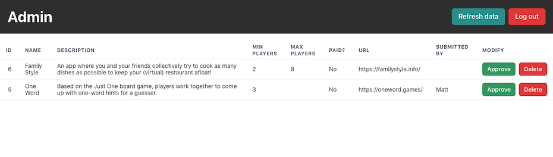

# What Should We Play? (Admin)

This repo is for the admin panel of [What Should We Play?](https://github.com/mm/wswp), a project I built for the [DigitalOcean App Platform Hackathon](https://dev.to/devteam/announcing-the-digitalocean-app-platform-hackathon-on-dev-2i1k). You can read over there about my motivation for starting the project and how to get started with setting up a dev environment!

Since the project was designed to be an index anyone can submit games to, I built this really quick admin panel to view and approve submissions that come in (to reduce spam). It was written in [React](https://reactjs.org) with the [Chakra UI](https://chakra-ui.com/) component library. [Auth0](https://auth0.com/) is used to authenticate and send tokens to the back-end when making requests at private endpoints. 

## 📚 Requirements

Before building this on your local computer, please make sure you go through the [back-end setup](https://github.com/mm/wswp) described in the README there because this depends on that!

You'll also need to have signed up for an Auth0 account and set up a single-page and API application there, similar to the [back-end setup](https://github.com/mm/wswp) process.

Please keep in mind if the `ADMIN_OFF` environment variable is set to `1` on the back-end, the routes this application depends on will not work.

## 🔖 Environment Variables

No matter where this application is deployed, these environment variables can affect its operation:

* `REACT_APP_AUTH_DOMAIN`: Your Auth0 domain from when you set up an account there and added a single-page application to it
* `REACT_APP_AUTH_CLIENT_ID`: Your Auth0 client ID from your Auth0 single-page application
* `REACT_APP_AUTH0_AUDIENCE`: The Auth0 audience when you set up an API on your console (per the [back-end setup](https://github.com/mm/wswp))
* `REACT_APP_API_URL`: The base URL for making all API requests. If you're running the back-end locally, this might be something like `http://localhost:8000/v1`

## 🔨 Getting started locally

1. Clone this repo to your computer: `git clone https://github.com/mm/wswp-admin`

2. Create an `.env.local` file and fill out the environment variables listed in [Environment Variables](#-environment-variables)

3. In the project root, run `yarn` and let dependencies install (you only need to do this once)

4. In the project root, run `yarn start` to start the development server and you're good to go!

## 🚀 Deploying to DigitalOcean

This panel can be easily deployed as a static site on DigitalOcean App Platform! First, make sure you've gone through the [back-end instructions for deploying to DigitalOcean](https://github.com/mm/wswp#-deploying-to-digitalocean). This involves pressing the "Deploy to DigitalOcean" button there and initializing the database with a few commands.

After that's done, you can use the Deploy to DigitalOcean button at the top of this repo to deploy it as a static site! You'll be asked to provide a value for the `REACT_APP_API_URL` environment variable. This is the app URL for your back-end app (which is separate from this one) + `/v1`, e.g `https://app-slug-example.ondigitalocean.app/api/v1`. 

Heads up that once deployed, get the app URL for the admin page and add this to your list of allowed callback URLs in Auth0!